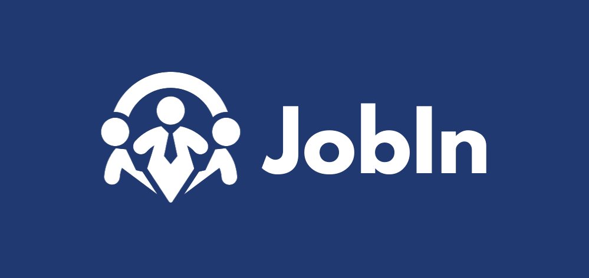
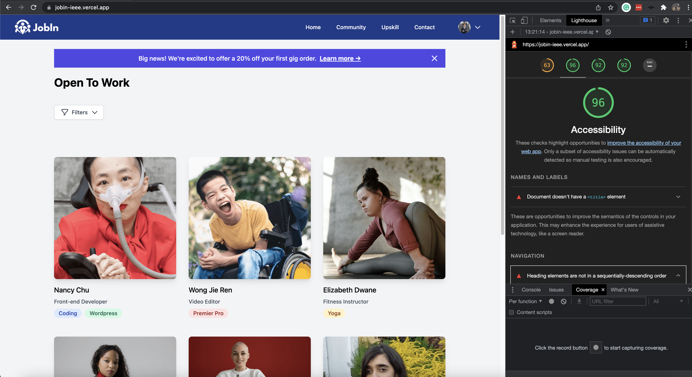
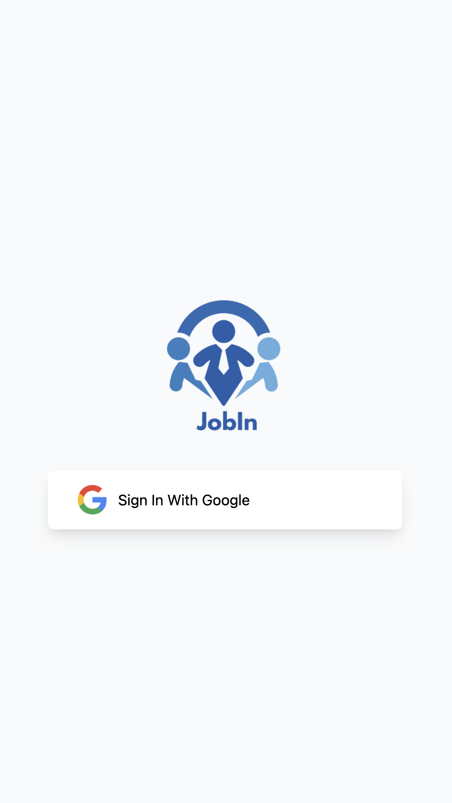
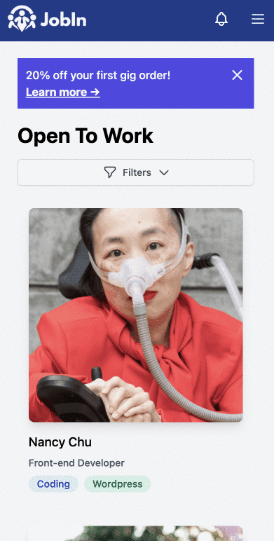

# Jobin

## Introduction

Jobin connects People with Disabilities(PWD) who are digitally competent to help “onboard” many of these SMEs into the digital era. Encouraging local businesses to think beyond the conventional way of approaching business and do what is relevant in the IR4.0 times.

Website Link: [Jobin](https://jobin-my.vercel.app)

## Problem

Our idea JobIn was inspired by one of our team members, Jia Da who is a PWD and struggles in the job-seeking world due to low accessibility and inclusivity in the workplace. He actively took out freelance jobs just to sustain himself, but he realized that the current job listing platform is not PWD focus enough as most of the employers/clients still prefer to hire normal people due to various reasons. He also mentioned his pain point in finding a PWDs friendly community that focused on gig work.

During the pandemic, he mentioned that he really spend his time helping SMEs to digitalize. This serves as a sweet spot between PWDs and not digitalized SMEs as that’s a gap between the SMEs that looking for tech savvy people to compete for the simple task while PWDs booking for Job opportunities.

## How we built it

We built the entire front end based on a UI-rich library called React.js. With Next.js to provide a server-side rendering solution with React, Next.js also serves as our main back end. We also utilized Vercel to deploy our code and view changes easily in different git branches. For FrontTech, we decided to use a utility-first approach for our CSS, which is by default 100% powered by TailwindCSS.

As for APIs, we leveraged on Firebase and Google Cloud Translate API to empower our users to have the best experience possible. With Google's technologies, we support up to 33 languages today!

| Language Support |
| ---------------- |
| Chinese          |
| Malay            |
| Afrikaans        |
| Arabic           |
| Basque           |
| French           |
| Greek            |
| Indonesian       |
| Korean           |
| Norwegian        |
| Swedish          |

And many more!

Check out the full list of supported languages [here](https://github.com/jason-beh/jobin/blob/main/utils/languages.js)

## Running Jobin in your local machine

1. Install node_modules

```bash
yarn
```

2. Configuring env variables
   Unfortunately, I won't be providing the secret env variables that I use, but these are the variables:

| Environment Variables         |
| ----------------------------- |
| GOOGLE_CLIENT_ID              |
| GOOGLE_CLIENT_SECRET          |
| GOOGLE_APPLICATION_CREDENTIAL |
| NEXTAUTH_URL                  |
| CLOUDINARY_UPLOAD_PRESET      |
| CLOUDINARY_CLOUD_NAME         |
| CLOUDINARY_API_KEY            |
| CLOUDINARY_API_SECRET         |
| FIREBASE_API_KEY              |
| FIREBASE_AUTH_DOMAIN          |
| FIREBASE_PROJECT_ID           |
| FIREBASE_STORAGE_BUCKET       |
| FIREBASE_MESSAGING_SENDER_ID  |
| FIREBASE_APP_ID               |

3. Run the app!

```bash
yarn dev
```

## Screenshots of Jobin






